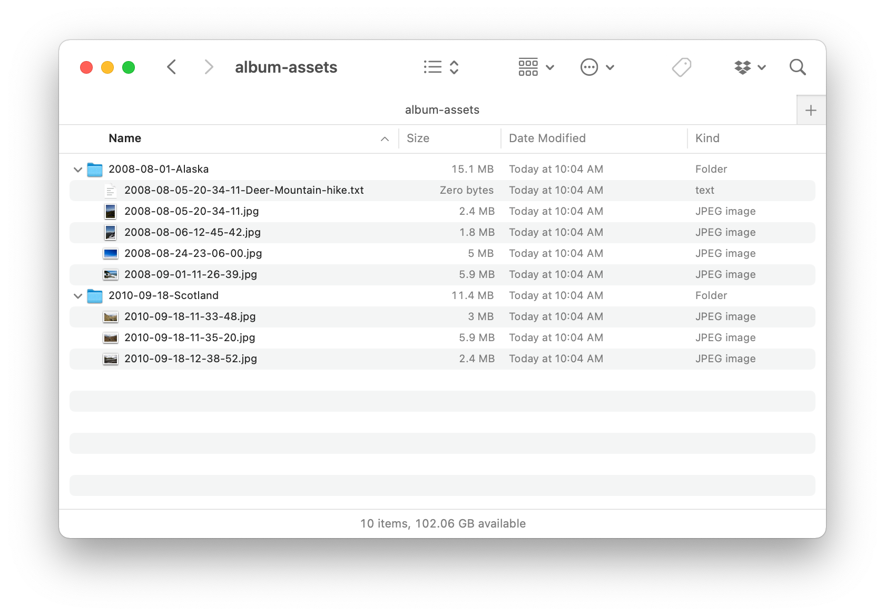

# Photobox

An 11ty site that generates web galleries from directories of images. Captions optional.

Built with [11ty](https://www.11ty.dev) and some help from the [link-in-bio-11ty](https://github.com/clottman/link-in-bio-11ty) theme

## Local setup

1. Open `siteData-example.json`, save as `siteData.json`. Edit the text values.
2. Add folders of images to `src/album-assets/` with a `YYYY-MM-DD-Album-Name` format.
3. Run `npm install`
4. For video processing, confirm you have [homebrew](https://brew.sh) installed, and use it to install ffmpeg via `brew install ffmpeg`.

## Viewing locally

4. If you've include `.mov` files in your albums, run `npm run video` to process those videos into 720p files.
5. Run `npm run start` to view your site at `localhost:8080`.

Note that the first run with many albums may take a long time to build, since 11ty's image plugin needs to build 3 optimized files for every original. The same goes for videos (processed by ffmpeg).

## Building for production

1. Run `npm run build` to generate the site.
2. To build the site files the above _and_ process videos, run `npm run build-all`.
