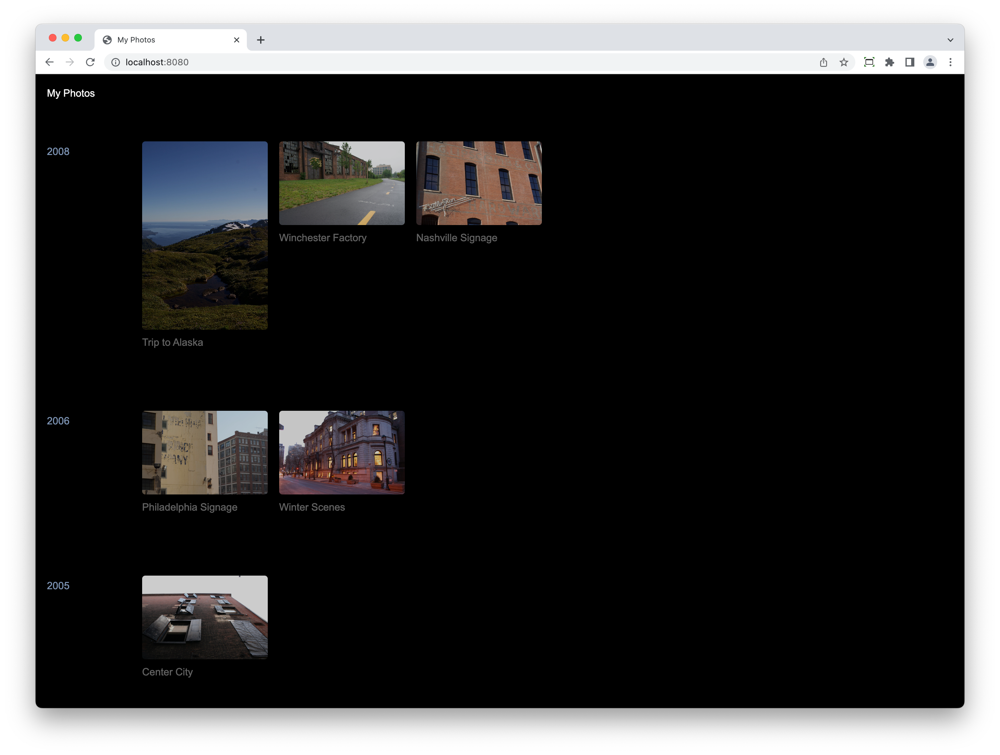

# Photobox

A static site script that generates web albums from directories of images and videos. Built with [11ty](https://www.11ty.dev).




## Local setup

1. Open `siteData-example.json`, save as `siteData.json`. Edit the properties with your information. `theme` can be set to `light`, `dark`, or `system`. `robots` is usally set to `all` or `none` ([more options here](https://yoast.com/robots-meta-tags/)).
2. Run `npm install`
3. For video processing, confirm you have [homebrew](https://brew.sh) installed, and use it to install ffmpeg via `brew install ffmpeg`.

## Creating albums

1. Add folders of images to `src/album-assets/`, where each folder follows the `YYYY-MM-DD-Album-Name` format (there are some examples in the repo).
2. Export your images to these folders as high-resolution JPGs. Images are output in alphabetical order, so `YYYY-MM-DD-HH-MM-SS.jpg` gives you the most reliable sorting by original capture time. [Exiftool](https://exiftool.org) and [a shell script](https://gist.github.com/jmuspratt/3680d45b0c12f8b32093) are useful here if your local photo software doesn't give you enough flexibility.
3. Within an album, you can insert text headings wherever you want. These require a `YYYY-MM-DD-` prefix: a file named `2020-05-01-Hiking-in-the-Alps.txt` will render as a `Hiking in the Alps` heading (and a jump link) just above the images/videos that follow it alphabetically. You can also add secondary text in the contents of the text file.
4. To hide an album from the sidebar navigation, include `-[hidden]` at the end of your album directory title.
5. If you've included `.mov` files in your albums, run `npm run video` to process those videos into 720p files. This may take a while.
6. Run `npm run start` to view your site at [http://localhost:3000](http://localhost:3000). Note that the first run with many albums may take a long time to build, since 11ty's image plugin needs to generate 3 optimized files for every original.

## Building and Deploying

1. Run `npm run build` to generate the site pages and optimized images.
2. To build the site files _and_ process videos, run `npm run build-all`.
3. Your site builds to the `/dist` directory. You can then sFTP the contents to your web server, or use rsync via `npm deploy`. If the latter, store your deploy path in an `.npmrc` like this:

```
deploy_path = username@123.456.78.90:/var/www/photos.example.com/html/
```

## Development roadmap

### Done

- [x] Display dates to right of text blocks
- [x] Add OG image for album pages
- [x] Light/Dark themes
- [x] Break up album list by year
- [x] JSON feed
- [x] Hidden albums
- [x] Deploy via npm/rsync

### Up Next?

- [ ] Remove orphaned optimized videos on build
- [ ] Method for adding `alt` text to images?
